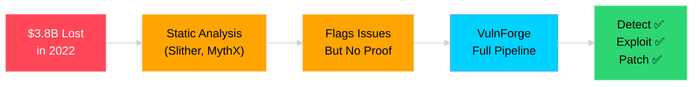
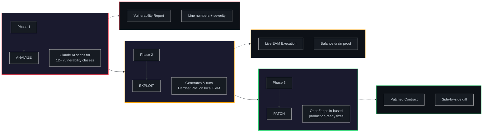
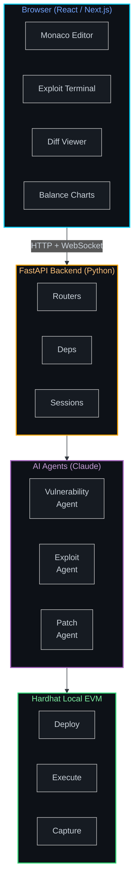
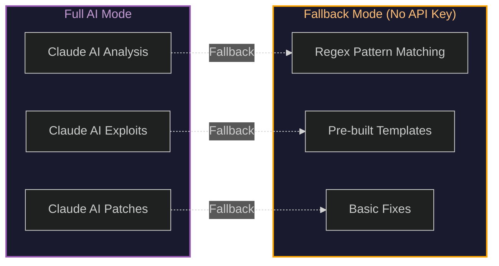

<p align="center">
  
  &nbsp;
  
  &nbsp;
  
  &nbsp;
  
  &nbsp;
  
</p>

<h1 align="center">
  
  <br>
  <span style="background: linear-gradient(135deg, #ff4757 0%, #ff6b81 50%, #00d2ff 100%); -webkit-background-clip: text; -webkit-text-fill-color: transparent; font-size: 3.2em; font-weight: 900;">VulnForge</span>
  <br>
  <sub style="color: #8b949e; font-size: 0.5em; font-weight: 400;">AI-Powered Smart Contract Exploit Simulator</sub>
</h1>

<p align="center">
  <b>Detect. Exploit. Patch.</b> — The full offensive security pipeline for Solidity smart contracts.
</p>

<p align="center">
  
  &nbsp;
  
  &nbsp;
  
</p>

---

<p align="center">
  
  <br>
  <i>Upload a contract, watch VulnForge find and exploit vulnerabilities in real-time</i>
</p>

---

## Table of Contents

- [Why VulnForge Exists](#why-vulnforge-exists)
- [Key Features](#key-features)
- [How It Works](#how-it-works)
- [Demo Screenshots](#demo-screenshots)
- [Quick Start](#quick-start)
- [Project Structure](#project-structure)
- [Architecture](#architecture)
- [API Reference](#api-reference)
- [Demo Contracts](#demo-contracts)
- [Tech Stack](#tech-stack)
- [Environment Variables](#environment-variables)
- [Troubleshooting](#troubleshooting)
- [For Security Researchers](#for-security-researchers)
- [License](#license)

---

## Why VulnForge Exists

<table>
<tr>
<td width="50%">

Smart contract vulnerabilities caused **$3.8 billion** in losses in 2022 alone.

Existing tools (Slither, MythX) flag suspicious patterns but **don't prove exploitability**.

VulnForge closes this gap by automating the entire offensive security lifecycle — from detection to proof-of-exploit to remediation.

</td>
<td width="50%">



</td>
</tr>
</table>

---

## Key Features

<table>
<tr>
<td align="center" width="33%">

<br><b>AI Vulnerability Detection</b>
<br><sub>Claude AI scans for 12+ vulnerability classes with line-level precision</sub>
</td>
<td align="center" width="33%">

<br><b>Real Exploit Execution</b>
<br><sub>Generates and runs Hardhat PoC scripts on a local EVM</sub>
</td>
<td align="center" width="33%">

<br><b>Production-Ready Patches</b>
<br><sub>OpenZeppelin-based fixes with annotated diffs</sub>
</td>
</tr>
<tr>
<td align="center" width="33%">

<br><b>Real-Time Streaming</b>
<br><sub>Live terminal output via WebSocket — watch exploits execute</sub>
</td>
<td align="center" width="33%">

<br><b>Balance Drain Visualization</b>
<br><sub>Animated charts showing before/after fund movement</sub>
</td>
<td align="center" width="33%">

<br><b>Works Without API Key</b>
<br><sub>Rule-based fallback for reentrancy, overflow, access control</sub>
</td>
</tr>
</table>

---

## How It Works

VulnForge runs a **three-phase pipeline** powered by AI agents:



### Phase 1 — Analyze

> The **Vulnerability Agent** sends your contract to Claude AI, which returns a structured JSON report with severity, line numbers, CWE IDs, and remediation tips.

<p align="center">
  
</p>

### Phase 2 — Exploit

> The **Exploit Agent** generates a complete Hardhat exploit script, deploys on local EVM, and streams execution output in real-time via WebSocket.

<p align="center">
  
</p>

### Phase 3 — Patch

> The **Patch Agent** generates a fixed contract using OpenZeppelin patterns, with annotated diffs showing every change.

<p align="center">
  
</p>

---

## Demo Screenshots

<table>
<tr>
<td align="center" width="50%">
<b>Landing Page</b><br>
<br>
<sub>Cybersecurity-themed dark UI with animated gradients</sub>
</td>
<td align="center" width="50%">
<b>Scan Dashboard</b><br>
<br>
<sub>Monaco editor + vulnerability cards + risk gauge</sub>
</td>
</tr>
<tr>
<td align="center" width="50%">
<b>Exploit Terminal</b><br>
<br>
<sub>Real-time xterm.js output streaming exploit execution</sub>
</td>
<td align="center" width="50%">
<b>Balance Drain Chart</b><br>
<br>
<sub>Animated Recharts visualization of fund movement</sub>
</td>
</tr>
</table>

> **Note:** To add your own screenshots, capture your app running locally and place them in `docs/assets/`. See [CONTRIBUTING.md](./CONTRIBUTING.md) for screenshot guidelines.

---

## Quick Start

### Prerequisites

| Requirement | Version | Purpose |
|-------------|---------|---------|
| **Python** | 3.10+ | Backend runtime |
| **Node.js** | 18+ | Frontend + Hardhat |
| **npm** | Latest | Package management |
| **Anthropic API Key** | Optional | AI-powered analysis (fallback mode available) |

### 1 — Clone the Repository

```bash
git clone https://github.com/soumyachk101/ChainPwn.git
cd ChainPwn
```

### 2 — Set Up Backend

```bash
cd backend

# Create and activate virtual environment
python3 -m venv venv
source venv/bin/activate    # Windows: venv\Scripts\activate

# Install dependencies
pip install -r requirements.txt

# Install Hardhat
cd hardhat_workspace && npm install && cd ..

# Configure (optional — for AI features)
cp .env.example .env
# Add your ANTHROPIC_API_KEY to .env
```

### 3 — Set Up Frontend

```bash
cd ../frontend
npm install
```

### 4 — Launch

```bash
# Terminal 1 — Backend
cd backend && source venv/bin/activate && python main.py

# Terminal 2 — Frontend
cd frontend && npm run dev
```

Open **http://localhost:3000** and try a demo contract.

---

## Project Structure

```
ChainPwn/
├── Docs/                              # Product documentation
│   ├── PRD_VulnForge_1.md            #   Product Requirements Document
│   ├── TRD_VulnForge_1.md            #   Technical Requirements Document
│   └── AI_Instructions_VulnForge_1.md #   AI agent instructions
│
├── backend/                           # Python FastAPI backend
│   ├── main.py                        #   Entry point — API server
│   ├── deps.py                        #   Shared singletons
│   ├── requirements.txt               #   Python dependencies
│   ├── .env.example                   #   Environment template
│   │
│   ├── agents/                        #   AI agents (the brain)
│   │   ├── vulnerability_agent.py     #     Phase 1: detect
│   │   ├── exploit_agent.py           #     Phase 2: exploit
│   │   └── patch_agent.py             #     Phase 3: patch
│   │
│   ├── blockchain/                    #   EVM execution engine
│   │   ├── hardhat_runner.py          #     Run exploit scripts
│   │   ├── contract_deployer.py       #     Deploy contracts
│   │   └── state_capture.py           #     Capture balances
│   │
│   ├── routers/                       #   API endpoints
│   │   ├── analyze.py                 #     POST /api/analyze
│   │   ├── exploit.py                 #     POST /api/exploit
│   │   ├── patch.py                   #     POST /api/patch
│   │   ├── report.py                  #     POST /api/report
│   │   └── ws.py                      #     WebSocket stream
│   │
│   ├── utils/                         #   Helpers
│   ├── demo_contracts/                #   Vulnerable test contracts
│   ├── templates/                     #   Exploit script templates
│   └── hardhat_workspace/             #   Local Hardhat EVM
│
└── frontend/                          # Next.js 14 frontend
    └── src/
        ├── app/                       #   Pages (landing, scan, API)
        ├── components/                #   UI components
        │   ├── editor/                #     Monaco Solidity editor
        │   ├── terminal/              #     Exploit terminal
        │   ├── dashboard/             #     Risk score gauge
        │   └── results/               #     Cards, diffs, charts
        ├── lib/                       #   API client, WebSocket, utils
        ├── store/                     #   Zustand state
        └── types/                     #   TypeScript definitions
```

---

## Architecture



---

## API Reference

All endpoints are prefixed with `/api`. Backend runs on `http://localhost:8000`.

<table>
<tr>
<th width="25%">Endpoint</th>
<th width="15%">Method</th>
<th width="60%">Description</th>
</tr>
<tr>
<td><code>/api/health</code></td>
<td><code>GET</code></td>
<td>Health check — returns <code>{"status": "ok"}</code></td>
</tr>
<tr>
<td><code>/api/analyze</code></td>
<td><code>POST</code></td>
<td>Submit contract source code for AI vulnerability analysis</td>
</tr>
<tr>
<td><code>/api/exploit</code></td>
<td><code>POST</code></td>
<td>Generate & execute exploit script for a specific vulnerability</td>
</tr>
<tr>
<td><code>/api/patch</code></td>
<td><code>POST</code></td>
<td>Generate patched contract with OpenZeppelin fixes</td>
</tr>
<tr>
<td><code>/api/report</code></td>
<td><code>POST</code></td>
<td>Generate Markdown security report</td>
</tr>
<tr>
<td><code>/ws/stream/{job_id}</code></td>
<td><code>WS</code></td>
<td>Real-time WebSocket stream of exploit execution</td>
</tr>
<tr>
<td><code>/api/demo-contracts</code></td>
<td><code>GET</code></td>
<td>List available demo contracts</td>
</tr>
</table>

<details>
<summary><b>Full API Request/Response Examples</b></summary>

### Analyze Contract
```json
POST /api/analyze
{
  "source_code": "// Solidity source code...",
  "contract_name": "MyContract",
  "session_id": "unique-session-id"
}
```
```json
Response: {
  "contract_name": "MyContract",
  "solidity_version": "^0.8.0",
  "overall_risk": "CRITICAL",
  "vulnerabilities": [
    {
      "id": "vuln_001",
      "type": "REENTRANCY",
      "severity": "CRITICAL",
      "title": "Reentrancy in withdraw()",
      "line_start": 15,
      "line_end": 22,
      "affected_function": "withdraw()",
      "cwe": "CWE-841",
      "recommendation": "Use ReentrancyGuard"
    }
  ],
  "audit_confidence": "HIGH"
}
```

### Generate & Execute Exploit
```json
POST /api/exploit
{
  "session_id": "unique-session-id",
  "vulnerability_id": "vuln_001",
  "source_code": "// Contract source...",
  "contract_name": "MyContract",
  "initial_eth_balance": "10"
}
```
```json
Response: {
  "exploit_job_id": "uuid",
  "status": "running",
  "ws_stream_url": "/ws/stream/{job_id}",
  "exploit_script": "// Generated Hardhat script...",
  "attack_flow": ["Step 1...", "Step 2..."]
}
```

### Generate Patch
```json
POST /api/patch
{
  "session_id": "unique-session-id",
  "source_code": "// Contract source...",
  "contract_name": "MyContract",
  "solidity_version": "^0.8.0",
  "vulnerabilities": [{ "id": "vuln_001", "type": "REENTRANCY", ... }]
}
```
```json
Response: {
  "patched_code": "// Fixed Solidity code...",
  "fixes_applied": [{ "type": "REENTRANCY", "fix_summary": "Added ReentrancyGuard" }],
  "new_dependencies": ["@openzeppelin/contracts"],
  "compilation_notes": "..."
}
```

### WebSocket Messages
```json
{
  "type": "LOG | STATE | EXPLOIT_CODE | RESULT | ERROR | PHASE",
  "data": "...",
  "job_id": "uuid",
  "timestamp": 1234567890.123
}
```

</details>

---

## Demo Contracts

VulnForge ships with three deliberately vulnerable contracts:

<table>
<tr>
<td width="33%" align="center">

<b style="color: #ff4757;">CRITICAL</b><br>
<b>EtherStore.sol</b><br>
<sub>Reentrancy</sub>

```solidity
function withdraw() public {
  uint256 bal = balances[msg.sender];
  require(bal > 0);
  (bool sent, ) = msg.sender
    .call{value: bal}("");
  // BUG: state update after
  balances[msg.sender] = 0;
}
```

</td>
<td width="33%" align="center">

<b style="color: #ffa502;">HIGH</b><br>
<b>BadToken.sol</b><br>
<sub>Integer Overflow</sub>

```solidity
function mint(uint256 amount) public {
  // BUG: no overflow check
  // in Solidity <0.8.0
  balances[msg.sender] += amount;
  totalSupply += amount;
}
```

</td>
<td width="33%" align="center">

<b style="color: #ffa502;">HIGH</b><br>
<b>SimpleVault.sol</b><br>
<sub>Missing Access Control</sub>

```solidity
function drain(
  address payable recipient
) public {
  // BUG: no onlyOwner!
  recipient.transfer(
    address(this).balance
  );
}
```

</td>
</tr>
</table>

---

## Tech Stack

<table>
<tr>
<td width="50%">

### Backend
| Technology | Purpose |
|:-----------|:--------|
| **Python 3.10+** | Runtime |
| **FastAPI** | Async web framework |
| **Anthropic SDK** | Claude AI integration |
| **Hardhat** | Local Ethereum EVM |
| **ethers.js v6** | Ethereum library |
| **WebSockets** | Real-time streaming |
| **Pydantic** | Validation |

</td>
<td width="50%">

### Frontend
| Technology | Purpose |
|:-----------|:--------|
| **Next.js 14** | React framework |
| **TypeScript** | Type safety |
| **Tailwind CSS** | Cybersecurity dark theme |
| **Monaco Editor** | Code editor |
| **Recharts** | Balance visualization |
| **Zustand** | State management |
| **Framer Motion** | Animations |

</td>
</tr>
</table>

---

## Environment Variables

| Variable | Required | Default | Description |
|:---------|:--------:|:-------:|:------------|
| `ANTHROPIC_API_KEY` | No | — | Anthropic API key for AI agents |
| `HARDHAT_WORKSPACE` | No | `./hardhat_workspace` | Path to Hardhat workspace |
| `MAX_CONCURRENT_EXPLOITS` | No | `5` | Max concurrent exploit jobs |
| `EXPLOIT_TIMEOUT_SECONDS` | No | `60` | Exploit execution timeout |
| `MAX_CONTRACT_SIZE_KB` | No | `500` | Max contract source size |
| `PORT` | No | `8000` | Backend server port |

---

## Without an API Key

VulnForge works **without** an Anthropic API key:



To enable full AI capabilities, add your key to `backend/.env`:
```
ANTHROPIC_API_KEY=sk-ant-your-key-here
```

---

## Troubleshooting

<details>
<summary><b>"Hardhat node_modules not found"</b></summary>

```bash
cd backend/hardhat_workspace
npm install
```
</details>

<details>
<summary><b>"npx: command not found"</b></summary>

Install Node.js from [nodejs.org](https://nodejs.org/).
</details>

<details>
<summary><b>Frontend won't start</b></summary>

```bash
cd frontend
rm -rf node_modules
npm install
npm run dev
```
</details>

<details>
<summary><b>Backend import errors</b></summary>

Run from the `backend/` directory with venv activated:
```bash
cd backend
source venv/bin/activate
python main.py
```
</details>

---

## For Security Researchers

VulnForge is designed for **authorized security testing and education**. Exploit execution runs on a **local Hardhat testnet only** — no real funds at risk.

| Use Case | Description |
|:---------|:------------|
| **Smart Contract Audits** | Accelerate vulnerability discovery with AI |
| **CTF Competitions** | Practice exploiting vulnerable contracts |
| **Education** | Understand reentrancy, overflow, and other attacks |
| **DevSecOps** | Integrate into CI/CD as a security gate |

---

## License

This project is for educational and authorized security research purposes.

---

## Acknowledgments

[](https://www.openzeppelin.com/)
[](https://hardhat.org/)
[](https://www.anthropic.com/)
[](https://microsoft.github.io/monaco-editor/)

---

<p align="center">
  <b>Built for Web3 Security</b><br>
  <sub>Star this repo if VulnForge helps your security research</sub>
  <br><br>
  
</p>
